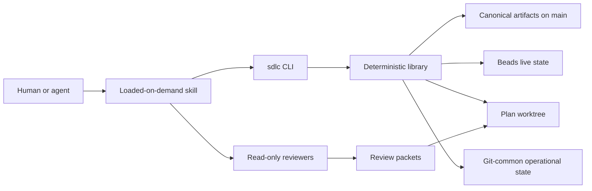

# How sdlc works under the hood

This guide describes the machinery behind sdlc 0.4. Start with the
[README](../README.md) if you want to install or use the workflow. This
document is for maintainers, reviewers, and anyone who wants to understand how
the pipeline decides what it can do and why it sometimes refuses.

sdlc is not one large autonomous agent. It has two layers:

- Skills hold the human-facing procedures: how to write a ticket, approve a
  plan, implement it, review it, and land it.
- The Node.js library and CLI handle facts that can be checked mechanically:
  parsing artifacts, reproducing hashes, reading Beads, selecting eligible
  work, validating stage preconditions, running gates, and building context
  packets.

Models handle judgment. Deterministic code owns state transitions and evidence
that should not depend on interpretation.

## The system at a glance



Four stores carry the workflow, and each has a narrow job:

| Store | What it owns | What it does not own |
|---|---|---|
| `thoughts/` on primary `main` | Ticket intent, approved plan text, research synthesis, stable AC and step IDs | Live claims or execution progress |
| Beads | Epics, step issues, dependencies, claims, gates, notes, memory, and worktree registration | Canonical ticket or plan prose |
| A Beads-managed worktree | Code changes and persisted aggregate review artifacts | Approval authority for ticket/plan snapshots |
| Git common state | Session actors and gate logs shared across linked worktrees | Product or workflow state |

Each fact has one owner. That avoids a common failure mode in agent workflows,
where two copies of the same fact quietly drift apart. A worktree may contain
an old copy of a plan, for example, but the pipeline never treats that copy as
approval truth.

## What setup installs

The `setup` command lives in `bin/sdlc.mjs`. Unless `--skip-beads` is supplied,
it checks the installed Beads version and required capabilities before it
scaffolds anything. An unsupported Beads installation therefore fails early
instead of leaving a half-enabled workflow behind.

A normal setup then:

1. initializes Git if needed;
2. creates `thoughts/{tickets,plans,designs,docs,reviews}/`;
3. installs the compact workflow contract at `thoughts/AGENTS.md` and a starter
   root `AGENTS.md`;
4. links `CLAUDE.md` to the corresponding `AGENTS.md` where symlinks are
   available;
5. installs all ten skills in `.agents/skills/` and links the Claude copies to
   that canonical installation;
6. installs four read-only reviewer profiles for Claude, Codex, or both;
7. initializes Beads when needed; and
8. installs the minimal `.beads/PRIME.md`.

The setup paths have different ownership rules. `--force` may refresh generated
contracts, skills, and reviewer profiles. The documentation index is seeded
only when `thoughts/docs/INDEX.md` is absent, so setup never erases a project's
curated document map. `.beads/PRIME.md` is managed and updated because its job
is to enforce the current minimal-startup contract.

Codex reviewer profiles are rendered from the same Markdown bodies used for
Claude. The renderer adds a read-only sandbox declaration and keeps the profile
body in one source of truth.

## Project Configuration

`lib/config.mjs` parses the `## Project Configuration` section in
`thoughts/AGENTS.md`. The grammar is intentionally small and readable as
Markdown rather than introducing another configuration file.

The parser understands:

- configured targets;
- ordered global quality gates;
- repeated target-specific gate mappings;
- repeated target-to-path mappings;
- target-to-reviewer mappings;
- product-doc and frontend constraints;
- embedded or server Beads mode;
- optional merge-slot use; and
- local review editor and preview commands.

Gate commands are opaque shell strings. Quotes, pipes, redirects, and
semicolons are retained exactly; sdlc does not tokenize and rebuild them.
Gate and path mappings that refer to an unknown configured target are errors.

`Target paths` drives reviewer lanes. Matching globs are sorted by specificity
for deterministic output, but a more specific match does not erase a broader
one. If a file matches two targets, it belongs to both. If no path map is
configured, the CLI says classification is model-owned and keeps the complete
readable diff instead of guessing from directory names.

## Artifacts and reproducible identity

`lib/artifacts.mjs` parses tickets, plans, and research syntheses. These are not
loose Markdown conventions: the parser checks the fields needed for a safe
transition.

A ticket must have a valid status, type, target, tags, and allocated acceptance
criteria such as `AC-001`. IDs stay allocated even when a criterion is removed;
the removed line remains visible with a reason.

A plan adds:

- the canonical ticket path and source-ticket hash;
- stable numbered steps;
- `Covers`, `Files`, `Depends on`, and `Parallelizable` for every active step;
- an acyclic dependency graph;
- Verification coverage for live acceptance criteria;
- reasoned waivers where applicable; and
- a bounded plan-critique result with stable `PC-NNN` findings.

The hash implementation is in `lib/fingerprint.mjs`. It decodes UTF-8
strictly, normalizes CRLF and lone CR to LF, removes extra terminal newlines,
adds exactly one terminal newline, and computes lowercase SHA-256. It preserves
all other characters, including frontmatter and meaningful whitespace. Every
skill and validator uses this one implementation through `sdlc hash`.

### Why approval records are reproducible

When `/approve` commits a ticket and plan, it appends this record to the Beads
epic:

```text
approval: plan-sha256=<hex> ticket-sha256=<hex> commit=<main-sha>
```

`lib/doctor.mjs` starts with the newest record and walks backward. It accepts
the first record whose commit is reachable from `main` and whose committed
ticket and plan bytes reproduce both hashes. Malformed or unreproducible later
notes become warnings.

The result is a tamper-evident approved plan without a second JSON sidecar. If
canonical ticket or plan text changes, the hash chain stops matching and the
state becomes `reapproval_required`.

## Beads as the mutation boundary

`lib/beads.mjs` wraps the Beads CLI with two explicit allowlists.

The read-only adapter accepts observation commands and mechanically prefixes
them with `bd --readonly`. It also rejects mutation-shaped flags such as
`--fix`, `--force`, and `--clean`. The mutating adapter accepts only the known
write commands and refuses to run without a valid session actor.

A root mutating session obtains an identity like:

```text
sdlc:codex:8a9f...
```

The actor is persisted under the Git common directory in
`.git/sdlc/actors/`. Linked worktrees and separate shells can therefore
rehydrate the same session identity. `--new` rotates the current root boundary.
Every actual Beads mutation still receives the literal as `BEADS_ACTOR`; the
registry is continuity, not implicit authorization.

Two agents may share the same operating-system user and Git identity. Those
ambient identities do not prove that they own the same claim. The first
implementation mutation is an atomic Beads claim, and a claim owned by another
session stops the transition.

At startup, sdlc also checks Beads `>= 1.1.0` and the capabilities the workflow
depends on: native read-only enforcement, atomic claims, spec identity,
dedicated gates, native worktrees, diagnostics, dependency operations, stale
signals, and orphan reporting. Optional batch and merge-slot support are
detected separately.

## Doctor: the complete read model

`sdlc doctor <NNN> --json` is the detailed diagnostic surface. Its work is
split into two parts so multi-ticket callers do not repeat repository-wide
queries.

`createDoctorInspectionContext()` collects shared facts once:

- the primary checkout and current HEAD;
- parsed Project Configuration;
- Beads installation and capability results;
- connection mode and health;
- ready and in-progress issues;
- dependency cycles;
- registered worktrees;
- gates, including an extra dependency lookup that recovers the blocked issue
  omitted by the Beads 1.1 gate-list row;
- non-gating human escalations;
- stale candidates and orphaned issue-bearing commits; and
- merge-slot state when enabled.

`inspectDoctor()` then adds the facts for one ticket number. It parses the
canonical ticket and applicable plan, resolves the epic and children, validates
the step-to-issue mapping and dependencies, reproduces approval history,
inspects the registered worktree and Git activity, and validates the newest
review artifact and its matching epic note.

The public JSON shape remains compact and stable. Rich parsed objects used by
snapshots and guards are attached as non-enumerable inspection data, so sharing
context does not silently expand existing doctor consumers.

Doctor reports one state and one exit class:

| State | Meaning | Exit |
|---|---|---:|
| `ready_for_planning` | Approved ticket, no active plan | 0 |
| `ready_for_approval` | Reviewed plan waiting for the human approval gate | 0 |
| `healthy` | Canonical artifacts, approval, Beads, worktree, and review agree | 0 |
| `reapproval_required` | Approved identity drifted | 2 |
| `legacy` | Pre-contract artifacts need explicit migration | 2 |
| `blocked` | A structural or coordination invariant is unsafe | 3 |

Exit `1` is reserved for invalid invocation or a completely unavailable
dependency. Doctor diagnoses; it never repairs.

## Snapshot: one collection for `/next` and `/queue`

`lib/snapshot.mjs` turns the shared doctor context into one compact JSON
document. It reuses that context instead of running separate Beads and doctor
commands for every ticket.

The snapshot enumerates active numbers from canonical ticket and plan filenames
and inspects each against the same context. It carries schema
`sdlc.snapshot.v1`, the primary HEAD, a state fingerprint, generation and expiry
timestamps, and global health. Snapshots expire after 30 seconds.

For `view=next`, one ordering controls eligibility:

1. approved plans with executable work are considered first;
2. approved tickets ready for planning come second; and
3. the first eligible item in deterministic number order is selected.

Rejected candidates remain visible with stable reasons such as `unhealthy`,
`foreign-claim`, `gated`, `no-ready-work`, `stale-candidate`,
`orphan-recovery`, `reapproval-required`, or
`file-overlap:<path>`. An open gate on one step does not freeze an unrelated
ready step. Declared file overlap with another in-flight plan does block the
candidate and includes the conflicting plan and scope as evidence.

The same document carries a human queue for approvals, landing, gates,
reapproval, explicit stale/orphan recovery, and draft-ticket approval. `/next`
uses the selected object as-is; it does not recalculate eligibility. If nothing
is selected, it reports idle and stops without another fact call or subagent.

For `view=queue`, the projection changes to five dashboard sections:

- work needing a human;
- in-flight plans and chores with Git evidence;
- work ready to start;
- draft tickets; and
- recent ticket-labelled landings.

Both views are mechanically read-only.

## Guard: stage-sized answers

Doctor is intentionally thorough, but feeding its full JSON into every loop
iteration is wasteful. `lib/guard.mjs` projects the same evidence through an
explicit acceptance matrix:

| Stage | Accepted modes | Important extra checks |
|---|---|---|
| `plan` | `new-plan` | Ticket is exactly ready for planning |
| `approve` | `first-approval`, `amendment`, `no-op` | Mode is legal for artifact state and existing mapping |
| `implement` | `execute`, `review` | Approval identity, compatible claim owner, ready work, gates, clean review handoff |
| `review` | `pending`, `existing` | Children closed, no gate/escalation, clean worktree, valid existing artifact |
| `land` | `normal`, `post-merge-recovery` | Approved bound review, clean worktree, no orphan, consent evidence, one proven merge |

Success is exactly one `OK` line with stable fields and warning codes. Refusal
includes the state, coded error, and a recovery action while preserving the
doctor exit class. Skills call full doctor only when a refusal needs deeper
evidence.

Landing has one additional historical check. An `Approval Attention` row still
marked open must have a closed or resolved dedicated-gate record that names the
same `AA-NNN`. Plan approval alone never fabricates execution-time consent.

## Gates: quiet on success, useful on failure

`lib/gates.mjs` runs commands in this order:

1. global `Quality gates`;
2. gates for the selected target; and
3. explicitly supplied `--command` values, labelled `ad-hoc`.

Commands run unchanged through the shell in the selected worktree. Before the
first command starts, sdlc proves that it can create protected log storage.
The preferred location is `.git/sdlc/logs/<run>/` in the Git common directory,
which keeps logs out of every linked worktree. If that location is unavailable,
it uses a repository-fingerprinted directory under the operating-system temp
directory. If both locations fail, no gate runs.

Log directories use mode `0700`; files use `0600`. Each log is capped at 1 MiB
with an explicit truncation marker, and only the newest ten runs are retained.
A `summary.json` records command, source, exit status, duration, parsed test
counts, log path, and truncation count.

Passing commands produce one line. A failure stops the sequence, preserves the
child exit status, and returns at most 40 relevant lines and roughly 8 KiB of
excerpt plus the protected log path. The child's full output is drained even
after the cap, preventing a noisy process from blocking on a full pipe.

## Compact implementation packets

`lib/review-packet.mjs` builds smaller prompts once the workflow has enough
facts to do that safely. It creates two packet types.

A step packet contains only what one implementer needs:

- exact step number, title, and instruction;
- Beads issue ID;
- `Covers` IDs and the quoted live AC text;
- declared files and dependencies;
- applicable gate commands and frontend constraints;
- canonical plan path, hash, and approval commit; and
- the worktree edit root.

The result has a fixed handoff shape:

```text
status=<pass|blocked> commit=<sha|none> files=<paths|none> gates=<summary> memory-candidates=<keys|none> blocker=<none|specific blocker>
```

The parent consumes those facts rather than the implementer's full transcript.
The complete plan remains available for a real ambiguity, but it is no longer a
mandatory repeated read.

## Review packets and interface discovery

`sdlc review-packet` starts with the complete changed-file inventory. Every
reviewer receives that inventory even when its diff is narrowed to one lane.
That inventory keeps changes outside the lane visible.

For each changed file, the packet builder reads the complete blob at the review
HEAD. A diff hunk alone is too narrow for interface discovery. Deleted files
fall back to the base blob. The builder
extracts textual import, require, and include specifiers, lexically normalizes
repository-relative and `./`/`../` paths, and compares changed paths with and
without extensions. The builder checks the graph in both directions. It
includes a cross-lane file when the lane file references it or when it
references the lane file.

The builder does not probe the filesystem or run a language-specific module
resolver. A binary file, unreadable blob, or readable file with no computable
interface match remains in the complete inventory with an explicit
`inventory-only` reason. Reviewers may read beyond the packet, but they must say
when they do.

Each packet also carries:

- ticket intent and live acceptance criteria;
- approved plan hash/commit and lane-relevant steps;
- lane and overlap classification;
- the lane diff plus cross-lane interface files;
- the newest persisted gate summary; and
- prior stable finding IDs for later rounds.

Chores use the same packet shape with an explicit `N/A` plan identity.

## Review evidence and convergence

Reviewers return standalone component reports. `lib/review-artifact.mjs`
validates their aggregate artifact rather than trusting prose around it.

A structured artifact binds:

- one reviewed code SHA;
- one approved plan SHA and approval commit, or the paired chore sentinel;
- a sorted unique reviewer list;
- exactly one section and verdict per reviewer;
- reviewer-scoped stable `MF-<lane>-NNN` finding IDs;
- scope and AC coverage controls;
- later-round finding dispositions; and
- one final aggregate verdict that agrees with every component.

An approval with no MUST FIX findings still needs Clean-Pass Evidence covering
ticket/AC intent, plan conformance, repository conventions, tests and failure
paths, and applicable risk surfaces. The contract does not force reviewers to
invent a problem; it requires them to show what they checked.

Malformed output gets one same-HEAD retry and does not consume a round. A valid
blocked round consumes one. Plan review caps at three completed rounds and
chore review at two. A non-decreasing MUST FIX count or the round cap creates a
non-gating human escalation rather than an endless model loop.

The approved aggregate is committed before its Beads note is appended:

```text
review: APPROVED sha=<artifact-head> code-sha=<reviewed-head> plan-sha256=<hex|N/A> plan-commit=<sha|N/A> rounds=<n>
```

Doctor reproduces this binding before landing.

## The lifecycle from ticket to merge

### Ticket

`/ticket` allocates a number, searches the project documentation index first,
and writes intent plus stable acceptance criteria. It does not approve its own
work. A human changes `Status: draft` to `Status: approved` after reading it.

### Plan

`/plan` uses the `plan` guard, retrieves only documentation and tagged memories
relevant to the ticket, and performs repository research inline. Up to three
independent read-only research tracks are used only when material unknowns
exist. A reusable synthesis records its ticket hash and Git baseline. The plan
then receives one independent critique and, if necessary, one scoped re-check.
It stops at `Status: review`.

### Approve

`/approve` is a human gate. On first approval it creates an epic and one child
per active step, adds dependency edges, writes stable spec metadata, updates the
canonical plan with its mapping, commits only the gate artifacts, and appends
the reproducible approval note.

An amendment reconciles the existing graph by stable step number: new steps get
new issues, removed steps close with a reason, unchanged closed work stays
closed, and dependencies are made exact. Git and Beads are not treated as one
transaction; reruns discover matching objects and complete only missing work.

### Implement

`/implement` runs the guard before any claim, refreshes `main` safely, captures
or inherits one root actor, and atomically claims the epic. It creates or
resumes the branch only through `bd worktree create` and verifies native
registration before using it.

Each loop iteration:

1. reruns the compact guard;
2. selects dependency-ready, ungated children;
3. serializes overlapping file scopes and parallelizes only disjoint steps the
   plan marked parallelizable;
4. claims the child and supplies its immutable step packet;
5. runs configured gates;
6. commits and pushes the step; and
7. closes the Beads issue only after the code is safely represented in Git.

A crash after the commit but before issue closure may appear in
`bd --readonly orphans`. That is recovery evidence, not permission to close the
issue blindly. The parent verifies the issue-bearing commit and gate result
before completing the close.

If a step needs a human decision, the parent creates a dedicated gate that
blocks that issue. Other ready children can continue. The `human` label is kept
for non-gating escalation; it is not used as a substitute for a gate.

After all active children close, the review guard, final gates, review packets,
component reviews, aggregate validation, and convergence rules produce the
persisted review evidence.

### Land

`/land` is another explicit human gate. It validates the approved plan and
review binding, checks historical consent evidence, optionally acquires a
preconfigured merge slot, and refreshes/rebases against current `main`.

A clean rebase reruns gates and is recorded. A conflict or semantic edit
invalidates the old review. With a clean primary checkout, landing squash-merges
the branch, flips the canonical plan to `merged` and ticket to `implemented`,
and creates one ticket-labelled merge commit.

Only after that commit exists does landing audit memory candidates. It then
closes Beads state, pushes Git and Beads independently, removes the worktree
through native safety checks without `--force`, deletes branches, and releases
an acquired merge slot after cleanliness and publication are proven.

If the merge succeeded but memory, push, close, or cleanup did not, a rerun
enters `post-merge-recovery`. It proves the existing merge and resumes after it;
it never creates a second merge commit.

### Chore and cancellation lanes

`/chore` is a bounded shortcut for tiny low-risk work. It creates an approved
chore ticket and one Bead, but no plan or epic. It still uses a native worktree,
gates, structured review, one merge commit, memory audit, and safe cleanup. If
the scope grows beyond the chore boundary, it stops and asks for a normal plan.

`/cancel` is deliberately more cautious because it may destroy unmerged work.
It shows the blast radius first and requires additional confirmation when a
worktree is dirty, unpublished, or stashed. Normal cleanup never forces native
worktree removal; cancellation is the only lane where a second explicit human
confirmation can authorize that destructive exception.

## Memory without startup bloat

The project prime contains workflow pointers and memory commands, not memory
bodies. Read-only observers and subagents do not prime. Planning searches exact
`tag:<tag>` markers and explicitly recalls only selected keys.

Implementation never writes durable memory directly. It appends structured
`memory-candidate:` notes to the epic. Landing waits until the merge commit
exists, checks each candidate against the merged tree, and then keeps,
refreshes, merges, forgets, or adds memories conservatively. Every durable
memory records retrieval tags, applicability, and merge provenance.

A cancelled or unmerged experiment therefore cannot become institutional
knowledge.

## Concurrency and recovery philosophy

sdlc assumes that Git and Beads cannot be committed atomically together.
Instead, every cross-store sequence is ordered and recoverable:

| Interrupted after | Recovery approach |
|---|---|
| Beads graph creation, before approval commit | Reuse objects by spec identity; do not duplicate them |
| Approval commit, before approval note | Reproduce the commit and append the missing note |
| Step commit/push, before issue close | Verify the issue-bearing commit and gates, then close explicitly |
| Review artifact commit, before review note | Reproduce the artifact and append the missing binding |
| Squash merge, before memory/close/push/cleanup | Prove the one merge commit and resume post-merge work |

Candidate stale claims require both a Beads age signal and corroborating
Git/worktree inactivity. Orphan signals require commit inspection. Neither is
an automatic repair instruction. The CLI never calls `bd doctor --fix` or
`bd orphans --fix`.

Merge slots are optional. When enabled, commands omit waiting: a held slot is
reported with holder and age so a human can decide whether recovery is safe.
The slot is released only after the state it protects is demonstrably clean.

## Public modules and CLI surfaces

`lib/index.mjs` re-exports the supported modules, and `package.json` also
provides subpath exports.

| Module | Responsibility | Main CLI surface |
|---|---|---|
| `artifacts.mjs` | Ticket, plan, and research parsing | Used by doctor, packets, and skills |
| `fingerprint.mjs` | Canonical artifact normalization and SHA-256 | `sdlc hash` |
| `beads.mjs` | Capability checks, actors, safe adapters, native diagnostics | `sdlc actor`; all state readers |
| `config.mjs` | Project Configuration grammar and lane classification | Gates, packets, local review |
| `doctor.mjs` | Full artifact/Beads/Git/review diagnosis | `sdlc doctor` |
| `snapshot.mjs` | Deterministic `/next` and `/queue` projection | `sdlc snapshot` |
| `guard.mjs` | Stage acceptance matrices | `sdlc guard` |
| `gates.mjs` | Ordered execution, bounded output, protected logs | `sdlc gates` |
| `review-packet.mjs` | Step and reviewer context packets | `sdlc review-packet` plus library API |
| `review-artifact.mjs` | Review grammar and convergence | Used by doctor and review skills |

`bin/sdlc.mjs` is intentionally a thin command dispatcher around these
libraries plus setup and local human review. Keeping the logic in importable
modules makes fixture testing possible without scraping CLI prose.

## Where operational files live

```text
thoughts/                   canonical intent, plans, research, reviews
.beads/                     Beads project data and managed PRIME.md
.worktrees/                 Beads-managed implementation worktrees
.git/sdlc/actors/           session actor registry shared by worktrees
.git/sdlc/logs/             preferred protected quality-gate logs
.agents/skills/             canonical installed skill copies
.claude/skills/             links to the canonical skills for Claude
.claude/agents/             Claude reviewer profiles
.codex/agents/              rendered read-only Codex reviewer profiles
```

The gate-log temp fallback is outside this tree and includes a fingerprint of
the repository path so unrelated repositories do not share logs.

## Testing the contract

The test suite combines parser unit tests with temporary-repository integration
tests. It covers:

- artifact, research, fingerprint, and review grammars;
- Beads command allowlists, actors, native gates, worktrees, claims, and prime;
- doctor states and reproducible approval history;
- snapshot schemas, selection reasons, overlap, stale corroboration, and queue
  evidence;
- every guard mode and refusal path;
- gate ordering, quoting, exit propagation, permissions, retention, truncation,
  and temp fallback;
- lane classification, bidirectional interfaces, binary/unreadable fallbacks,
  and step packets; and
- idempotent setup with exactly four reviewer profiles and no primed memory
  bodies.

Run everything with:

```bash
npm test
```

For a release-shaped check, run that command through `sdlc gates` as well. The
full test output stays in protected logs while the caller receives parsed
counts and one concise success line.

## A practical way to debug a refusal

Start with the smallest deterministic surface and expand only when needed:

1. `sdlc snapshot --view=queue --json` for the cross-pipeline picture;
2. `sdlc guard <stage> <NNN>` for the exact transition you want;
3. `sdlc doctor <NNN> --json` for full evidence;
4. `bd --readonly show <id> --json` or another focused read-only Beads query
   when doctor names a specific object; and
5. the protected gate log when a command failed.

Do not edit live state just to make a refusal disappear. First determine which
store owns the disputed fact. Most recovery bugs come from updating the
convenient copy instead of the canonical one.
